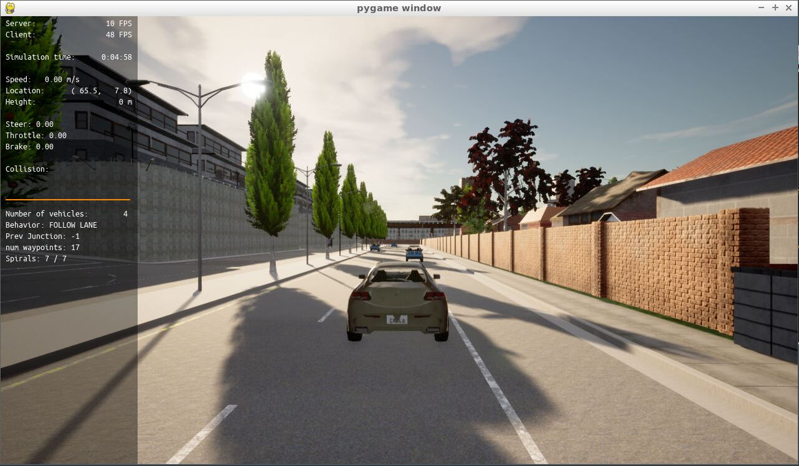
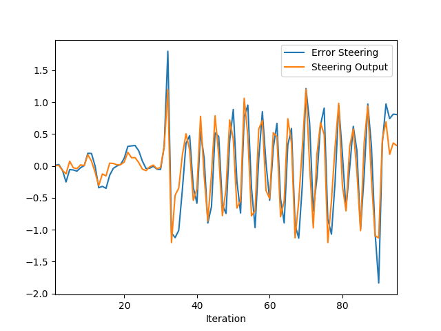
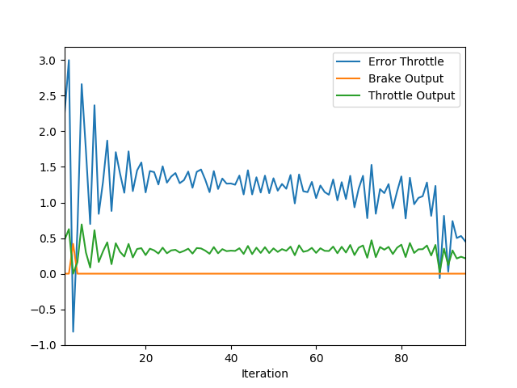

# PID Controller for Path Tracking in Autonomous Vehicle

## Question 1
**Add the plots to your report and explain them (describe what you see)**
Plots can be found in the following path
```
./screenshot/
```
- Figure below shows the running vehicle in CARLA simulator.


- Figure below shows the steering error and steering output.


- Figure below shows  


 An oscillatory pattern can be observed. This is due to lack of fine tuning the gains associated with the PID controller. In case of a fine-tuned PID controller, the proportional term would penalize deviation from the path recommended by the path planner module, the derivative term would reduced the effect of any overshoots, and the integral term would diminish the steady state error when the vehicle traveling through the targeted lane. Nevertheless, we can observed similarities between the steering error adn the steering output implying the error tracking via the controller. Similar trend can be observed for the throttle control.


## Question 2
**What is the effect of the PID according to the plots, how each part of the PID affects the control command?**
- **Proportional controller:** This term of the PID controller is responsible for reducing the error meaning that it enforces the vehicle to follow the goal. The problem with the proportional control is the overshooting. This effect can be seen in the figure as oscillatory pattern.

- **Integral controller:** This term of the PID controller is responsible for reducing the offset, i.e., steady state error. The figures shows that this term was better tuned compared to other terms.

- **Derivative controller:** This term of the PID controller is responsible for attenuating the overshooting effect caused by the proportional term. As demonstrated above, the derivative term was better tuned for the throttle control compared to the steering control.

## Question 3
**How would you design a way to automatically tune the PID parameters?**

Several approaches exist to tune the PID control:
- Grid search: a grid search algorithm could be employed to find best set og PID gains that minimize a cost function (e.g., tracking error).
- Twiddle: this algorithm taught in the course could be used to obtain a set of PID gains from a given intial values and step size.
- Reinforcement learning: reinforcemend learnig could provide a prize-based learning scheme based on maximizing the cumalitive award. 
- Fuzzy logic: a fuzzy system can be developed to provide a gain-scheduling scheme in way that schedules the value of PID gains based on a lookup table (se of fuzzy rules) defined based on the condition of the instantanous error, error derivative, and error sum. The parameters of the fuzzy membership functions can be tuned using an optimization and backporpogation. A training dataset obtained from manual driving could be helpful in this case.

## Question 4
**PID controller is a model free controller, i.e. it does not use a model of the car. Could you explain the pros and cons of this type of controller?**
The main advantage of PID controller is its simplicity. The disadvantage of the PID control is its inability to work under different maneuvers meaning that PID gains tuned for a specific maneuvers (e.g., lane following) may not work well during other maneuvers (e.g., obstacle avoiding or lane change). In addition, it does not taken into account any information from the plant dynamics.

## Question 5
**What would you do to improve the PID controller?**
I would use the methods that I mentioned in response to question 3 to improve the tuning process of the PID gains. A more complicated model of steering error and throttle error based on vector fields could provide better sense from the actual error and can lead to better controller design. In addition, adapting PID gains using a fuzzy gain-scheduler or self-tuning regulator (designed based on online identification of plant dynamics) could also be useful.

I'd also prefer to use a more complicated control scheme such as model predictive control and reinforcement learning for control of the autonomous vehicle.